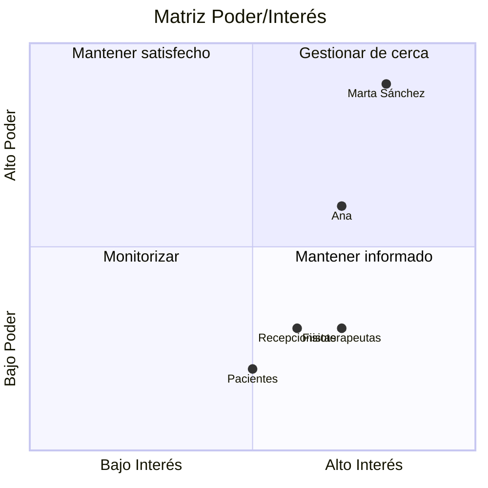

# Registro de interesados

| Interesado | Rol/Interés | Poder | Interés | Estrategia |
|---|---|---|---|---|
| Marta Sánchez | Gerente, patrocinadora | Alto | Alto | Gestionar de cerca |
| Ana (administradora) | Punto de contacto operativo del día a día | Medio | Alto | Colaborar estrechamente |
| Fisioterapeutas | Usuarios finales | Bajo | Alto | Mantener informados |
| Recepcionistas | Usuarias finales | Bajo | Alto | Mantener informados |
| Pacientes | Beneficiarios | Bajo | Medio | Monitorizar |

