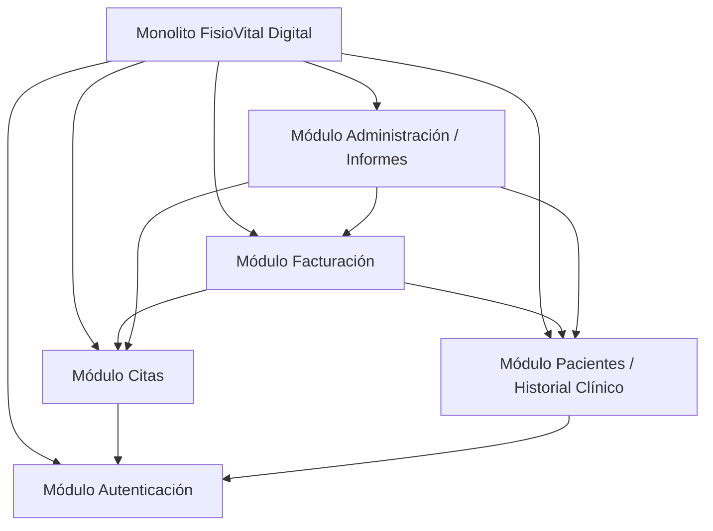

# ADR 001 — Arquitectura monolítica modular

## Estado
Aceptada

## Contexto
FisioVital cuenta con un presupuesto acotado (25.000€–35.000€) y un plazo fijo de 3 meses, con un equipo reducido (1 Backend, 1 Frontend, 1 QA, 1 DevOps). El sistema debe cubrir 5 clínicas con un volumen moderado de usuarios (~15 fisioterapeutas, 8 recepcionistas, ~600 pacientes). No hay indicios de que se necesite escalar de forma independiente por módulo, ni de tráfico que justifique la complejidad operativa de microservicios. Priorizamos velocidad de desarrollo y simplicidad de despliegue sobre escalabilidad horizontal prematura.

## Decisión
Se adopta una arquitectura **monolítica modular**, con un único desplegable
dividido en los siguientes módulos:
- Autenticación / Usuarios
- Citas
- Pacientes / Historial Clínico
- Facturación
- Administración / Informes

## Alternativas consideradas
| Alternativa | Ventajas | Inconvenientes |
|---|---|---|
| Microservicios | Escalabilidad independiente por módulo, aislamiento de fallos | Complejidad de infraestructura y coordinación inviable para un equipo de 4 personas en 3 meses; mayor coste de DevOps |
| Monolito no modular | Máxima velocidad inicial de desarrollo | Alto acoplamiento, difícil de mantener o dividir el trabajo en paralelo entre Backend/Frontend |
| Monolito modular (elegida) | Balance entre velocidad de desarrollo, orden interno y posibilidad de extraer módulos a futuro si fuera necesario | Requiere disciplina para no acoplar módulos entre sí pese a estar en el mismo desplegable |

## Consecuencias
- Un único pipeline de CI/CD y un único entorno de despliegue, lo que simplifica el trabajo de DevOps dado el presupuesto ajustado.
- Los módulos deben comunicarse mediante interfaces internas claras (no acceso directo a datos de otro módulo), para no perder los beneficios de la modularidad.
- Cualquier cambio en un módulo requiere desplegar el sistema completo; aceptable dado el tamaño del equipo y el volumen de usuarios actual.

## Condiciones que aconsejarían migrar en el futuro
- Si FisioVital crece más allá de las 5 clínicas actuales y el volumen de pacientes/citas exige escalar un módulo de forma independiente (ej. Citas en hora pico).
- Si se incorpora un equipo más grande y los módulos empiezan a bloquearse entre sí durante el desarrollo.
- Si se requiere disponibilidad diferenciada por módulo (ej. Facturación con SLA distinto al resto).

## Reparto de módulos por rol
| Módulo | Responsable principal | Apoyo |
|---|---|---|
| Autenticación | Backend | DevOps |
| Citas | Backend + Frontend | QA |
| Pacientes/Historial | Backend | QA |
| Facturación | Backend + Frontend | QA |
| Administración/Informes | Frontend | Backend |