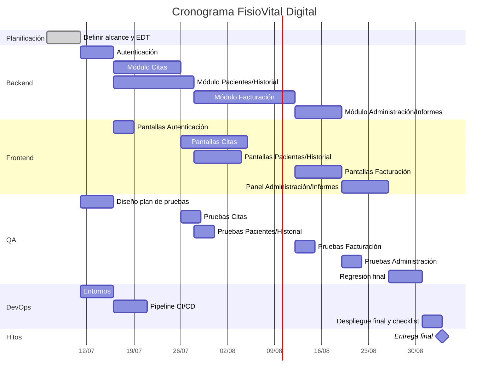

# Cronograma — FisioVital Digital

## Estimaciones recogidas del equipo
| Módulo/tarea | Responsable | Duración estimada | Depende de |
|---|---|---|---|
| Autenticación | Backend | 1 semana | Inicio del proyecto |
| Módulo Citas | Backend | 2 semanas | Autenticación |
| Módulo Pacientes/Historial | Backend | 2,5 semanas | Autenticación |
| Módulo Facturación | Backend | 3 semanas | Citas y Pacientes/Historial |
| Módulo Administración/Informes | Backend | 1,5 semanas | Citas, Pacientes, Facturación |
| Pantallas Autenticación | Frontend | 0,5 semana | Backend: Autenticación |
| Pantallas Citas | Frontend | 2 semanas | Backend: Citas + contrato API |
| Pantallas Pacientes/Historial | Frontend | 1,5 semanas | Backend: Pacientes/Historial |
| Pantallas Facturación | Frontend | 1,5 semanas | Backend: Facturación + contrato API |
| Panel Administración/Informes | Frontend | 1,5 semanas | Resto de módulos backend |
| Diseño plan de pruebas | QA | 1 semana | En paralelo, desde el inicio |
| Ejecución de pruebas por módulo | QA | 0,5 semana por módulo | Cierre de cada módulo |
| Regresión final | QA | 1 semana | Todos los módulos completos |
| Configuración de entornos | DevOps | 1 semana | Inicio del proyecto |
| Pipeline CI/CD | DevOps | 1 semana | Entornos configurados |
| Despliegue final y checklist | DevOps | 0,5 semana | Regresión final de QA |

