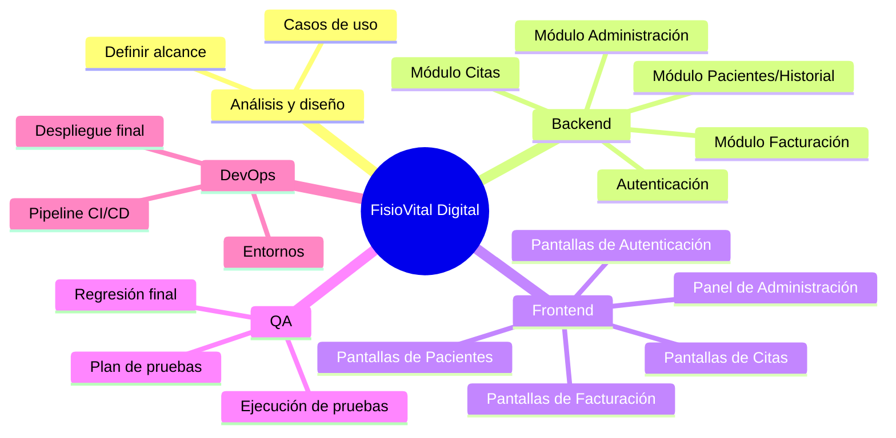

# EDT / WBS — FisioVital Digital

```mermaid
mindmap
  root((FisioVital Digital))
    Análisis y diseño
      Definir alcance
      Casos de uso
    Backend
      Autenticación
      Módulo Citas
      Módulo Pacientes/Historial
      Módulo Facturación
      Módulo Administración
    Frontend
      Pantallas de Autenticación
      Pantallas de Citas
      Pantallas de Pacientes
      Pantallas de Facturación
      Panel de Administración
    QA
      Plan de pruebas
      Ejecución de pruebas
      Regresión final
    DevOps
      Entornos
      Pipeline CI/CD
      Despliegue final
```