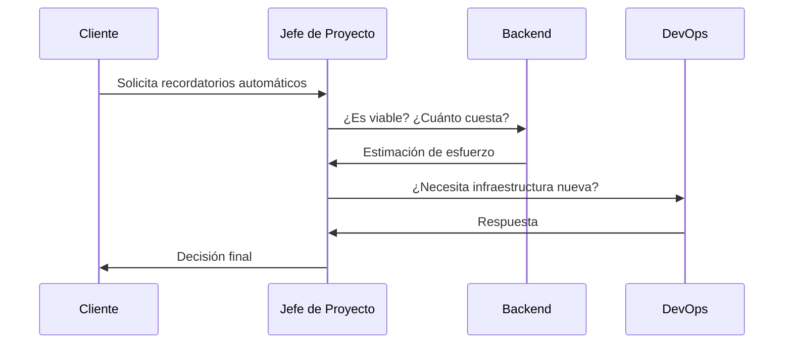

# CR-001 — Solicitud de cambio: recordatorios automáticos de cita

## Solicitante
Marta Sánchez (Gerente FisioVital)

## Descripción de la solicitud
Marta solicita que el sistema envíe recordatorios automáticos a los pacientes antes de su cita, con el objetivo de reducir las citas perdidas por olvido (que generan horas de fisioterapia paradas y pérdida económica). Propone email o SMS, según lo que sea más viable.

## Análisis de impacto
**Alcance:** Añade una funcionalidad no contemplada en el contrato de API original (Sesión 2). Requiere lógica de programación de tareas (envío programado antes de cada cita).
**Tiempo:** ~4-5 días de desarrollo si es solo por email; ~8-10 días si se incluye también SMS.
**Coste:** Desarrollo dentro de la reserva de contingencia si es solo email (sin coste de infraestructura adicional). Si se incluye SMS, hay que sumar el coste de alta y uso mensual recurrente de un proveedor externo (ej. Twilio), no contemplado en el presupuesto actual.
**Riesgos:** Retraso adicional sobre el módulo de Facturación, que ya viene retrasado (ver informe de seguimiento Semana 6, SPI 0,84). Cualquier ampliación de alcance en este momento compite por los mismos recursos de Backend.

## Recomendación técnica
Backend confirma viabilidad técnica para recordatorios por email sin necesidad de infraestructura nueva, estimado en 4-5 días. DevOps confirma que la opción de SMS requeriría contratar un proveedor externo con coste recurrente, fuera del presupuesto aprobado. Se recomienda implementar solo el canal de email en esta fase, dejando SMS como mejora futura si el presupuesto lo permite.

## Decisión
Aceptado con condiciones — Fecha: 09/08/2026. Se implementan recordatorios automáticos solo por email, dentro de la reserva de contingencia del presupuesto. El canal SMS queda fuera de alcance del proyecto actual y se documenta como posible ampliación futura.

