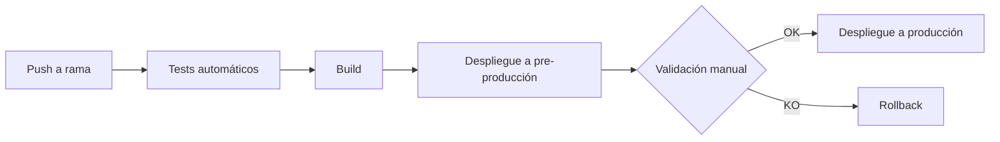

# Estrategia de despliegue — FisioVital Digital

## Entornos
| Entorno | Propósito |
|---|---|
| Desarrollo | Entorno de trabajo diario del equipo, donde se prueban cambios antes de promocionarlos |
| Pre-producción | Réplica de producción para validación final antes del despliegue real, incluyendo pruebas de QA |
| Producción | Entorno real usado por las 5 clínicas de FisioVital |

## Pipeline CI/CD

## Estrategia de despliegue a producción
El paso de pre-producción a producción se realiza únicamente tras validación manual de QA, confirmando que los tests automáticos y la revisión funcional no presentan bloqueantes. Si la validación falla, se ejecuta un rollback a la versión estable anterior antes de reintentar el despliegue. Ningún cambio de configuración (variables de entorno, conexiones a base de datos, etc.) se aplica directamente en pre-producción o producción sin haber sido probado primero en el entorno de Desarrollo.

## Lección aplicada tras INC-001
A raíz de la caída de pre-producción por un cambio de variable de entorno sin validar (INC-001), se incorpora como regla obligatoria que ningún cambio de configuración se aplique directamente sobre pre-producción o producción: todo cambio de este tipo debe probarse primero en Desarrollo. Además, se añade un paso de verificación de arranque post-despliegue dentro del pipeline, antes de dar por exitoso el despliegue a cualquier entorno.

## Checklist de salida a producción
- [ ] Tests automáticos pasados sin errores
- [ ] Validación manual de QA completada en pre-producción
- [ ] Plan de pruebas de Facturación (Ejercicio 3.4) ejecutado al 100%, sin bloqueantes
- [ ] Variables de entorno y configuración verificadas y probadas previamente en Desarrollo
- [ ] Backup reciente disponible antes del despliegue
- [ ] Plan de rollback confirmado y accesible para el equipo