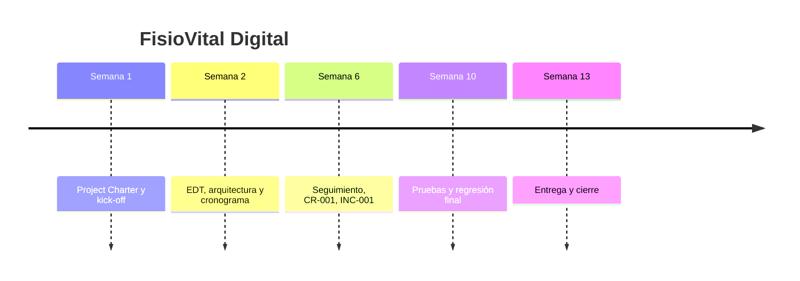

# Postmortem — FisioVital Digital

## Resumen ejecutivo
El proyecto FisioVital Digital se entregó con una semana de retraso (13 vs. 12 previstas) y un 5% por encima del presupuesto (31.500€ vs. 30.000€), principalmente por la complejidad subestimada del módulo de Facturación. Durante la ejecución se gestionaron con éxito una solicitud de cambio (CR-001) y un incidente técnico (INC-001), ambos documentados y trazables en el repositorio.

## Línea temporal

## Qué funcionó bien
- La arquitectura monolítica modular permitió un desarrollo paralelo ordenado entre Backend y Frontend, con responsabilidades claras desde el ADR.
- El plan de pruebas basado directamente en el contrato OpenAPI cubrió casos límite reales, no solo el camino feliz, evitando incidencias críticas de Facturación en producción.
- La gestión del CR-001 con análisis de impacto explícito permitió aceptar el cambio sin comprometer el presupuesto ni el plazo de forma descontrolada.

## Qué no funcionó: análisis de causa raíz (5 porqués) de INC-001
1. ¿Por qué se cayó el entorno de pre-producción? Porque la aplicación no pudo arrancar tras aplicarse un cambio de configuración.
2. ¿Por qué la aplicación no pudo arrancar? Porque se modificó una variable de entorno de conexión a la base de datos de forma incorrecta.
3. ¿Por qué se modificó de forma incorrecta? Porque el cambio se aplicó directamente en pre-producción sin haberlo probado antes en el entorno de Desarrollo.
4. ¿Por qué no se validó antes en Desarrollo? Porque no existía ningún proceso obligatorio que exigiera esa validación previa antes de tocar configuración en pre-producción.
5. ¿Por qué no existía ese proceso? Porque la estrategia de despliegue se formalizó después del incidente, no antes: durante la planificación se dio por sentado el pipeline técnico, pero no se documentaron reglas explícitas de gestión de cambios de configuración.

**Causa raíz:** Ausencia de un proceso formal de gestión de cambios de configuración entre entornos, lo que dejaba la validación previa a la disciplina individual en lugar de a una regla obligatoria del pipeline.

## Impacto de la arquitectura monolítica modular en el cierre
La arquitectura monolítica modular facilitó el cierre: al ser un único desplegable, la verificación final y el despliegue a producción se gestionaron como un solo proceso, sin necesidad de coordinar versiones entre servicios independientes. Para el mantenimiento futuro, la modularidad interna (interfaces claras entre Autenticación, Citas, Pacientes/Historial, Facturación y Administración) deja la puerta abierta a extraer un módulo como servicio independiente si el crecimiento de FisioVital lo justifica en el futuro, sin tener que rediseñar el sistema desde cero.

## Recomendaciones
- **Para el equipo:** formalizar la regla de "ningún cambio de configuración sin validar antes en local" como parte del checklist de despliegue desde el inicio del proyecto, no como reacción a un incidente.
- **Para la organización:** incorporar una validación técnica más profunda de la complejidad de cada módulo durante la fase de planificación (especialmente en módulos con lógica de negocio compleja, como Facturación), para evitar desviaciones de plazo y coste detectadas recién en el seguimiento de ejecución.